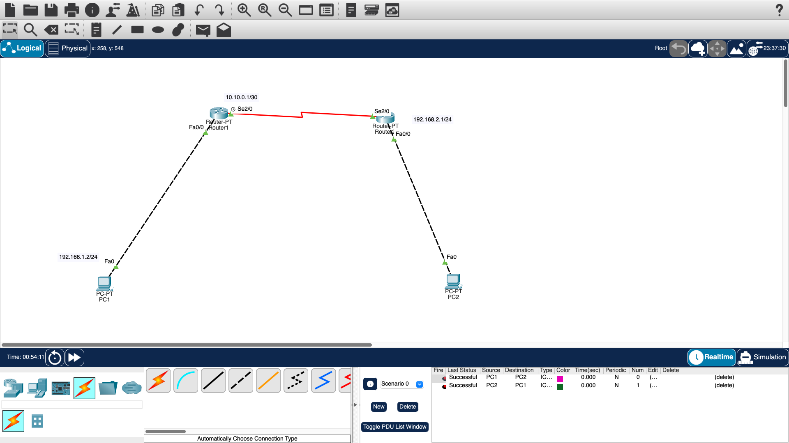

# Deep In Net Project

## Overview

This project demonstrates various network setups and configurations using Cisco Packet Tracer. The goal is to understand and recreate network architectures, exploring key networking concepts such as IP addressing, DNS, DHCP, HTTP, HTTPS, FTP, and the differences between networking devices like switches, hubs, and routers.

## Network Architectures

### Network 1: Basic Router and PC Setup

- **Components**: 
  - 1 Router
  - 2 PCs
- **IP Addresses**:
  - PC0: 192.168.1.2/30
  - PC1: 192.168.2.2
- **Configuration**: The router connects two PCs with different subnets, demonstrating basic IP routing and connectivity.

### Network 2: Server and Client Configuration

- **Components**: 
  - 1 Switch
  - Multiple PCs
  - Servers (HTTP, FTP, DNS, DHCP)
- **IP Addresses**: 
  - PCs: 192.168.1.x/24
  - Servers: 192.168.1.99 (HTTPS), 192.168.1.100 (FTP), 192.168.1.101 (DNS)
- **Configuration**: The switch connects several PCs and servers, showing how different services (HTTP, FTP, DNS, DHCP) are configured and accessed in a network.

### Network 3: Switch and Hub Configuration

- **Components**: 
  - Switches
  - Hubs
  - PCs
- **Configuration**: This setup demonstrates the differences between switches and hubs, including their roles and operations within a network.

### Network 4: Advanced Network Setup

- **Components**: 
  - Multiple Switches
  - Multiple PCs
- **Configuration**: This complex setup illustrates advanced network configurations, focusing on efficient data packet forwarding and network segmentation.

### Network 5: VLAN Configuration

- **Components**: 
  - Switches
  - PCs
  - Servers
- **Configuration**: This setup involves VLAN configuration, demonstrating network segmentation and efficient traffic management within the same physical network.

### Network 6: WAN Configuration

- **Components**: 
  - Routers
  - Switches
  - PCs
  - Servers
- **Configuration**: This network simulates a Wide Area Network (WAN) configuration, connecting multiple local networks over a larger geographical area.

### Network 7: VPN Configuration

- **Components**: 
  - Routers
  - Switches
  - PCs
  - Servers
- **Configuration**: This setup illustrates a Virtual Private Network (VPN) configuration, enabling secure communication over public networks.

### Network 8: Load Balancing

- **Components**: 
  - Load Balancers
  - Servers
  - PCs
- **Configuration**: This network demonstrates load balancing techniques, ensuring efficient distribution of network traffic across multiple servers.

## Key Networking Concepts

### 1. Devices and Their Roles
- **Server**: Acts as a central hub, providing resources and services like files, websites, emails, etc.
- **Router**: Directs data between networks, determining the best path for data packets.
- **Switch**: Connects devices within a single network, forwarding data based on MAC addresses.
- **Hub**: Broadcasts data to all connected devices without any intelligence.

### 2. Protocols and Their Functions
- **DHCP**: Automatically assigns IP addresses to devices, simplifying network management.
- **DNS**: Translates domain names to IP addresses, enabling device communication over the internet.
- **HTTP/HTTPS**: Protocols for web communication; HTTPS adds security through encryption.
- **FTP**: Protocol for transferring files between a client and server.

### 3. Communication Layers
- **TCP/UDP**: Operate at the transport layer (Layer 4) of the OSI model. TCP is reliable and ordered, while UDP is faster but less reliable.
- **OSI Model Layers**: Hubs operate at Layer 1 (Physical), switches at Layer 2 (Data Link), and routers at Layer 3 (Network).

### 4. IP Addressing and Subnetting
- **IP Calculation**: Based on the subnet mask and network address. Subnet mask determines the network and host portions of an IP address.

### 5. Network Cables
- **RJ-45 Cable**: Commonly used in LANs, connecting devices with either T568A or T568B standards.
- **Straight Through vs. Crossover Cables**: Used for connecting different types of devices or similar devices, respectively.

## Steps to Recreate the Network Architectures

1. **Setup Devices**: Use Cisco Packet Tracer to place routers, switches, hubs, PCs, and servers in the workspace.
2. **Assign IP Addresses**: Configure the IP addresses for each device as specified in the network diagrams.
3. **Configure Services**: Setup DNS, DHCP, HTTP, HTTPS, and FTP services on the appropriate servers.
4. **Connect Devices**: Use RJ-45 cables to connect devices as shown in the network diagrams.
5. **Test Connectivity**: Verify the network setup by pinging between devices and accessing services.

## Conclusion

This project provides a comprehensive understanding of network architectures and configurations. By following the steps and concepts outlined, you can recreate and explore various network setups, gaining practical insights into networking.

